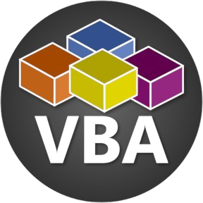

### Hi there 👋🏻

I'm Cansu, a third year computer engineering student specializing in game development with Unity Engine. Below, you can learn about the programming languages and tools I am familiar with.

### 🕹️Game Portfolio: [https://cansuarslangiray.github.io/](https://cansuarslangiray.github.io/)

### Programming languages I use: 

    
    
    
    
    

### Technologies
- Unity Engine for game development 🕹️
- Java for backend development 💽
- NextJS for web development 🕸️
- Git for version control system 🎛️
- Jetbrains Toolchain ⚙️
- Visual Studio Toolchain ⚙️
